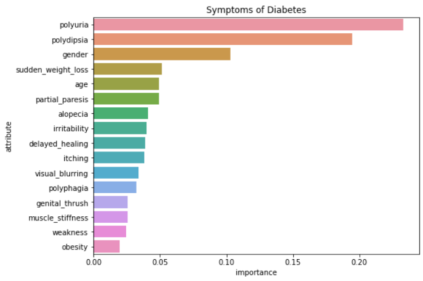

# Diabetes Risk Prediction

Diabetes is a chronic metabolic condition characterized by high levels of blood sugar, which causes long-term damage to the heart, blood vessels, eyes, kidneys, 
and nerves. Type 2 diabetes is the most common, mainly affecting adults, and occurs when the body fails to produce enough insulin (WHO,2018).
 
 
According to WHO, diabetes affects around 422 million people globally. This disease is directly responsible for 1.5 million fatalities per year.
Diabetes detection at an early stage can lower the risk of a person developing devastating complications.

## Problem Statement
This project aims to predict the chance of a patient having diabetes based on a certain set of symptoms.

## About the Data
This data was collected from Sylhet Diabetes Hospital of Sylhet, Bangladesh. Direct questionnaires were distributed to patients who have just become diabetic or who are still non-diabetic but have a few or more symptoms.
- The dataset contains 520 records and 17 columns including the target variable
- There are no missing values in the dataset
- **Age** is the only numerical column in the data
- The average age of the respondents is about 48 years
- The youngest respondent is 16 years old while the oldest respondent is 90 years of age
- More than 60 percent of the cases were diabetic
- Over 60 percent of the respondents were male patients

## Data Preprocessing
The categories were binary encoded (0 and 1) 

## Model Training and Evaluation
A model that detects as many diabetic cases as possible should be of interest to us. As a result, recall was employed to select the preferred model.  
Linear and Tree-based models were trained on the preprocessed data. The ensemble models produced encouraging results, with **ExtraTreesRegressor** correctly classifying **98.75 percent** of the diabetic cases

## Conclusion
**Polyuria (excessive peeing), Polydipsia (extreme thirst), and gender** are the most important early indicators of diabetes.

## Prediction Tool
The chosen model was used to build a tool that predicts the risk level (in percentage) of diabetes in a person

<a href='https://share.streamlit.io/hassan-ademola/diabetes_prevention/main/app.py'><b>Click Here</b></a> to run the prediction tool

